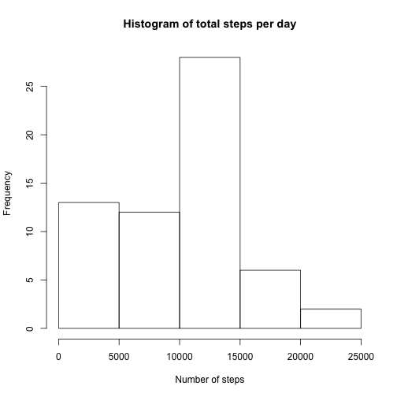
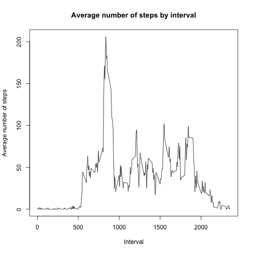
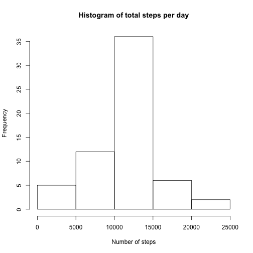
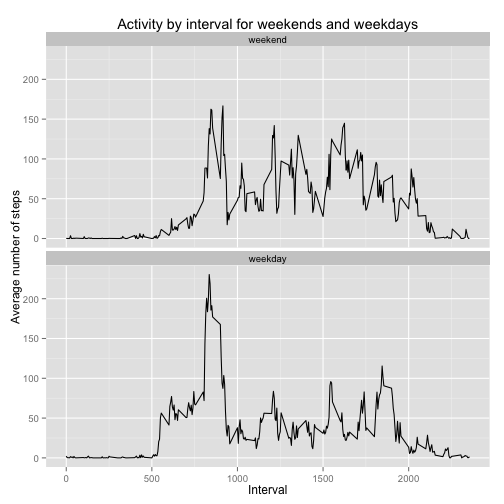

## Loading and preprocessing the data
**Show any code that is needed to**

**1. Load the data (i.e. read.csv())**

**2. Process/transform the data (if necessary) into a format suitable for your analysis**

Load packages that will be used later and set display option for Knitr. Save the Rmarkdown file in the folder that contains the CSV file called 'activity.csv'. Then read the data, making sure strings are not converted to factors. Finally, convert strings to dates.


```r
library(dplyr)
library(ggplot2)
options(digits = 2)
data <- read.csv('activity.csv',stringsAsFactors=FALSE)
data$date<-as.Date(data$date)
```

## What is mean total number of steps taken per day?

**For this part of the assignment, you can ignore the missing values in the dataset.**

**1. Calculate the total number of steps taken per day.**

Create a new dataset that contains the total number of steps for each day.


```r
by_date <-data %>%
    group_by(date) %>%
    summarise(totalsteps=sum(steps,na.rm=T))
```


**2. If you do not understand the difference between a histogram and a barplot, research the difference between them. Make a histogram of the total number of steps taken each day.**

Create a histogram using the hist() function.


```r
hist(by_date$totalsteps,main='Histogram of total steps per day',xlab='Number of steps')
```

 

**3. Calculate and report the mean and median of the total number of steps taken per day**


```r
mean_steps <- mean(by_date$totalsteps)
median_steps <- median(by_date$totalsteps)
print(mean_steps,digits=6)
```

```
## [1] 9354.23
```

```r
print(median_steps)
```

```
## [1] 10395
```

The mean of the daily number of steps is 9354.23 and the median is 10395.

## What is the average daily activity pattern?
**1. Make a time series plot (i.e. type = "l") of the 5-minute interval (x-axis) and the average number of steps taken, averaged across all days (y-axis)**

First, create a new dataset that contains the average number of steps for each interval across all days. Next, plot the average number of steps across the intervals.


```r
by_interval <-data %>%
    group_by(interval) %>%
    summarise(meansteps=mean(steps,na.rm=T))
with(by_interval, plot(x=interval,y=meansteps,type="l",xlab="Interval",ylab="Average number of steps",main="Average number of steps by interval"))
```

 

**2. Which 5-minute interval, on average across all the days in the dataset, contains the maximum number of steps?**

Using the dataset with the average number of steps by interval, filter out the observation (row) with the highest average number of steps.


```r
by_interval %>%
    filter(meansteps==max(meansteps))
```

```
## Source: local data frame [1 x 2]
## 
##   interval meansteps
## 1      835       206
```

Interval 835 contains the maximum of the average number of steps, i.e. 206.17 steps.

## Imputing missing values

**Note that there are a number of days/intervals where there are missing values (coded as NA). The presence of missing days may introduce bias into some calculations or summaries of the data.**

**1. Calculate and report the total number of missing values in the dataset (i.e. the total number of rows with NAs)**

Below I show two ways of calculating the total number of rows with NAs. 

```r
summary(data)
```

```
##      steps           date               interval   
##  Min.   :  0    Min.   :2012-10-01   Min.   :   0  
##  1st Qu.:  0    1st Qu.:2012-10-16   1st Qu.: 589  
##  Median :  0    Median :2012-10-31   Median :1178  
##  Mean   : 37    Mean   :2012-10-31   Mean   :1178  
##  3rd Qu.: 12    3rd Qu.:2012-11-15   3rd Qu.:1766  
##  Max.   :806    Max.   :2012-11-30   Max.   :2355  
##  NA's   :2304
```

```r
sum(1-complete.cases(data))
```

```
## [1] 2304
```
Only the column 'steps' contains NAs, as shown by the `summary` command. However, if more columns would contain NAs, then we could check the incomplete rows using the command `sum(1-complete.cases(data))`. Both ways show that the total number of missing values in the dataset is 2304.

**2. Devise a strategy for filling in all of the missing values in the dataset. The strategy does not need to be sophisticated. For example, you could use the mean/median for that day, or the mean for that 5-minute interval, etc.**

The mean number of steps for each 5 minute interval was calculated above in the dataframe 'by_interval' (see also code below). This dataframe contains two columns: the interval and the mean number of steps for that interval. This dataframe will be used to fill in the missing values in the original dataset. Specifically, missing data in a certain interval will be replaced by the mean number of steps for that interval across all days. The missing data will be identified by a logical vector called 'userows' that is TRUE when the number of steps is missing and FALSE otherwise.


```r
by_interval <-data %>%
    group_by(interval) %>%
    summarise(meansteps=mean(steps,na.rm=T))
str(by_interval)
```

```
## Classes 'tbl_df', 'tbl' and 'data.frame':	288 obs. of  2 variables:
##  $ interval : int  0 5 10 15 20 25 30 35 40 45 ...
##  $ meansteps: num  1.717 0.3396 0.1321 0.1509 0.0755 ...
##  - attr(*, "drop")= logi TRUE
```

```r
userows <- is.na(data$steps)
table(userows)
```

```
## userows
## FALSE  TRUE 
## 15264  2304
```


**3. Create a new dataset that is equal to the original dataset but with the missing data filled in.**

First, copy the original dataframe. Next, merge the new dataframe with the dataframe 'by_interval'. The merge will by default happen on the column whose name appears in both datasets, which is the column called 'interval'. So now 'data2' contains 4 columns: the date, the interval, the number of steps on that interval and that date and the mean number of steps in that interval across all dates. 


```r
data2 <- data
sum(is.na(data2$steps))
```

```
## [1] 2304
```

```r
data2 <- merge(data2,by_interval)
str(data2)
```

```
## 'data.frame':	17568 obs. of  4 variables:
##  $ interval : int  0 0 0 0 0 0 0 0 0 0 ...
##  $ steps    : int  NA 0 0 0 0 0 0 0 0 0 ...
##  $ date     : Date, format: "2012-10-01" "2012-11-23" ...
##  $ meansteps: num  1.72 1.72 1.72 1.72 1.72 ...
```

Next, identify which rows have NAs in the 'steps' column by creating a logical vector called 'userows'.


```r
userows <- is.na(data2$steps)
```

Finally, replace the NA values in the column 'steps', identified by the logical vector, by the mean number of steps in that same row. We can then again remove the additional column containing the mean number of steps.


```r
data2$steps[userows] <- data2$meansteps[userows]
data2$meansteps<-NULL
sum(is.na(data2$steps))
```

```
## [1] 0
```

**4. Make a histogram of the total number of steps taken each day and calculate and report the mean and median total number of steps taken per day. Do these values differ from the estimates from the first part of the assignment? What is the impact of imputing missing data on the estimates of the total daily number of steps?**

Repeat the steps from the first question to recreate the histogram using the new dataset with imputed data.


```r
by_date2 <-data2 %>%
    group_by(date) %>%
    summarise(totalsteps=sum(steps,na.rm=T))

hist(by_date2$totalsteps,main='Histogram of total steps per day',xlab='Number of steps')
```

 

```r
mean_steps2 <- mean(by_date2$totalsteps)
median_steps2 <- median(by_date2$totalsteps)

print(mean_steps2,digits=7)
```

```
## [1] 10766.19
```

```r
print(median_steps2,digits=7)
```

```
## [1] 10766.19
```

The mean of the total number of steps per day is 10766.19 and the median is also 10766.19. The median is still fairly close to the first estimate of 10395, but the mean has increased substantially. The distribution becomes more symmetric and Gaussian looking. In the original dataset, many days had no or few observations of steps for any interval, which led to many days in which the total number of steps was zero or very low. In the new dataset, the missing values were replaced with the mean values for that interval, so that the number of days with zero steps went down substantially.

## Are there differences in activity patterns between weekdays and weekends?
**For this part the weekdays() function may be of some help here. Use the dataset with the filled-in missing values for this part. Create a new factor variable in the dataset with two levels – “weekday” and “weekend” indicating whether a given date is a weekday or weekend day.**

First, let's check the prevalence of each day of the week in the data set.


```r
table(weekdays(data2$date))
```

```
## 
##    Friday    Monday  Saturday    Sunday  Thursday   Tuesday Wednesday 
##      2592      2592      2304      2304      2592      2592      2592
```

There are 2304 occurences of each day of the weekend (Saturday and Sunday) and 2592 each of the weekdays (Monday, Tuesday, Wednesday, Thursday and Friday).

Next, create a logical vector that is TRUE when the day of the week is 'Saturday' or 'Sunday', and FALSE otherwise. Then, transform the logical vector into a factor variable.


```r
data2 <- data2 %>%
        mutate(weekpart=(weekdays(date)=="Saturday"|weekdays(date)=="Sunday"))
data2$weekpart <- factor(data2$weekpart,levels=c("TRUE","FALSE"),labels=c("weekend","weekday"))
```

A table of the new factor variable shows that there are indeed 4608 weekend days (2x2304) in the dataset. 

```r
table(data2$weekpart)
```

```
## 
## weekend weekday 
##    4608   12960
```

The new dataset now contains an additional factor variable with 2 levels, labelled "weekend" and "weekday".

```r
str(data2)
```

```
## 'data.frame':	17568 obs. of  4 variables:
##  $ interval: int  0 0 0 0 0 0 0 0 0 0 ...
##  $ steps   : num  1.72 0 0 0 0 ...
##  $ date    : Date, format: "2012-10-01" "2012-11-23" ...
##  $ weekpart: Factor w/ 2 levels "weekend","weekday": 2 2 1 2 1 2 1 2 2 1 ...
```

**Make a panel plot containing a time series plot (i.e. type = "l") of the 5-minute interval (x-axis) and the average number of steps taken, averaged across all weekday days or weekend days (y-axis). See the README file in the GitHub repository to see an example of what this plot should look like using simulated data.**

First, create a new dataset that contains the average number of steps for each interval for weekdays and weekend days.


```r
by_interval_weekpart <-data2 %>%
    group_by(interval,weekpart) %>%
    summarise(meansteps=mean(steps,na.rm=T))
```

Next, create the plot, for example using ggplot2.


```r
ggplot(by_interval_weekpart, aes(interval, meansteps))+geom_line()+facet_wrap(~weekpart,ncol=1)+labs(y="Average number of steps", x="Interval",title="Activity by interval for weekends and weekdays")
```

 

It seems that the activity pattern does differ between weekdays and weekends. Overall activity seems higher on weekends except for a peak in activity on weekdays around the 800th interval.
